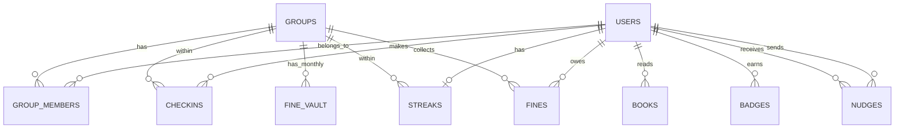

# Full Implementation Plan — Reading Club

> Technical slug used across all docs for folder/project names: `reading-club`.

---

## Table of Contents

1. [Philosophy & Principles](#1-philosophy--principles)
2. [Tech Stack](#2-tech-stack)
3. [Project Structure](#3-project-structure)
4. [Database Design](#4-database-design)
5. [Backend — Authentication](#5-backend--authentication)
6. [Backend — API Endpoints](#6-backend--api-endpoints)
7. [Backend — Core Business Logic](#7-backend--core-business-logic)
8. [Background Jobs](#8-background-jobs)
9. [Frontend — Pages & Components](#9-frontend--pages--components)
10. [Frontend — State Management](#10-frontend--state-management)
11. [Feature Details](#11-feature-details)
12. [Implementation Roadmap](#12-implementation-roadmap)
13. [Deployment](#13-deployment)
14. [Future Expansion](#14-future-expansion)
15. [Full Task Breakdown](#15-full-task-breakdown)

---

## 1. Philosophy & Principles

- **Golden rule:** the app rewards **commitment**, not **reading volume**. Someone who reads one page every day for 30 days should rank above someone who read 500 pages in two days and vanished for the rest of the month.
- **Honor system + a bit of fun:** a symbolic fine (20 EGP per missed day) + streaks + confetti + weekly titles, without making the vibe feel like pressure or hostile competition.
- **Closed group:** friends only, joining via an invite code — no "browse public groups" in the MVP.
- **Built to expand later:** the data model is designed from day one so that "reading" is just one "activity type," so you can add Quran memorization / exercise / language learning later without rebuilding the foundation.

---

## 2. Tech Stack

Same stack you already run for DENTIX — the fastest path for you since you're already fluent in it, and there's no need to learn new tools for a project this size.

| Layer | Tool |
|---|---|
| Backend Framework | FastAPI (Python) |
| Database | **PostgreSQL hosted on Supabase** (managed, no hand-rolled infrastructure) |
| ORM | SQLAlchemy 2.0 (async) + Alembic for migrations — connects to Supabase via a normal connection string |
| Auth | JWT handled manually inside FastAPI (access + refresh tokens) — **not** Supabase Auth, so all permission logic stays in one trusted place |
| Background Jobs | **APScheduler** inside the same FastAPI process (not Celery — the group is small, <20 users, no need for the added complexity of a Redis broker) |
| Frontend | React 18 + Vite + TypeScript |
| Styling | Tailwind CSS |
| Server State | TanStack Query |
| Client/UI State | Zustand |
| Notifications (Phase 5) | WhatsApp Business Cloud API (Meta) |
| Backend hosting | Railway (or Fly.io as an alternative) — backend and frontend are separate from the database |
| Frontend hosting | Vercel (or Netlify / Cloudflare Pages) — static build from Vite |

> **Important decision:** Supabase offers ready-made Auth/Storage/Edge Functions, but we're using it **as a managed Postgres only** (and later possibly Storage for book/avatar images as an easy bonus). The backend itself stays FastAPI as planned, because Supabase doesn't host Python processes. See section [13. Deployment](#13-deployment) for details.

---

## 3. Project Structure

### Backend

```
backend/
├── alembic/
│   └── versions/
├── app/
│   ├── main.py
│   ├── core/
│   │   ├── config.py          # reads .env
│   │   ├── security.py        # hashing, JWT
│   │   └── scheduler.py       # APScheduler setup
│   ├── db/
│   │   ├── session.py
│   │   └── base.py
│   ├── models/
│   │   ├── user.py
│   │   ├── group.py
│   │   ├── checkin.py
│   │   ├── streak.py
│   │   ├── fine.py
│   │   ├── book.py
│   │   ├── badge.py
│   │   └── notification.py
│   ├── schemas/                # Pydantic schemas (mirror the models)
│   ├── api/
│   │   └── v1/
│   │       ├── routes/
│   │       │   ├── auth.py
│   │       │   ├── groups.py
│   │       │   ├── checkins.py
│   │       │   ├── leaderboard.py
│   │       │   ├── fines.py
│   │       │   ├── books.py
│   │       │   └── stats.py
│   │       └── deps.py         # dependencies (get_current_user, get_db)
│   ├── services/
│   │   ├── streak_service.py
│   │   ├── fine_service.py
│   │   ├── badge_service.py
│   │   └── whatsapp_service.py
│   └── tasks/
│       ├── daily_close.py      # close the day + calculate absences and fines
│       ├── weekly_titles.py
│       └── monthly_summary.py
├── tests/
├── .env.example
├── docker-compose.yml
└── requirements.txt
```

### Frontend

```
frontend/
├── src/
│   ├── main.tsx
│   ├── App.tsx
│   ├── api/
│   │   ├── client.ts            # axios/fetch instance + interceptors
│   │   ├── auth.ts
│   │   ├── groups.ts
│   │   ├── checkins.ts
│   │   └── ...
│   ├── hooks/                   # TanStack Query hooks
│   │   ├── useCheckin.ts
│   │   ├── useLeaderboard.ts
│   │   └── useStreak.ts
│   ├── store/                   # Zustand
│   │   ├── authStore.ts
│   │   └── uiStore.ts
│   ├── pages/
│   │   ├── Login.tsx
│   │   ├── Register.tsx
│   │   ├── Onboarding.tsx       # create/join a group
│   │   ├── Dashboard.tsx
│   │   ├── Calendar.tsx
│   │   ├── Leaderboard.tsx
│   │   ├── Bookshelf.tsx
│   │   ├── Vault.tsx            # fine vault
│   │   ├── Profile.tsx
│   │   └── GroupSettings.tsx
│   ├── components/
│   │   ├── CheckinButton.tsx
│   │   ├── StreakFlame.tsx
│   │   ├── ProgressBar.tsx
│   │   ├── CalendarGrid.tsx
│   │   ├── LeaderboardRow.tsx
│   │   ├── BadgeDisplay.tsx
│   │   ├── ConfettiOverlay.tsx
│   │   ├── BookCard.tsx
│   │   ├── NudgeButton.tsx      # the "rescuer" badge
│   │   └── AvatarFrame.tsx
│   └── styles/
├── .env.example
└── vite.config.ts
```

---

## 4. Database Design

### Simplified ERD



### Tables in detail

#### `users`
| Column | Type | Notes |
|---|---|---|
| id | UUID (PK) | |
| name | VARCHAR(100) | |
| email | VARCHAR(255) | UNIQUE, NOT NULL |
| phone | VARCHAR(20) | nullable — for WhatsApp later |
| password_hash | VARCHAR(255) | bcrypt/argon2 |
| avatar_url | TEXT | nullable |
| level | INT | default 1 |
| xp_points | INT | default 0 |
| current_frame | VARCHAR(50) | default 'none' — unlocked avatar frame |
| created_at | TIMESTAMPTZ | |

#### `groups`
| Column | Type | Notes |
|---|---|---|
| id | UUID (PK) | |
| name | VARCHAR(100) | |
| invite_code | VARCHAR(10) | UNIQUE — random code |
| owner_id | UUID (FK → users) | |
| checkin_deadline_time | TIME | default '00:00' |
| grace_period_hours | INT | default 3 (grace window for logging after midnight) |
| fine_amount | NUMERIC(10,2) | default 20.00 |
| currency | VARCHAR(10) | default 'EGP' |
| fun_mode_enabled | BOOLEAN | default true (confetti/titles) |
| monthly_page_goal | INT | nullable — group's collective goal |
| created_at | TIMESTAMPTZ | |

#### `group_members`
| Column | Type | Notes |
|---|---|---|
| id | UUID (PK) | |
| group_id | UUID (FK) | |
| user_id | UUID (FK) | |
| role | ENUM('owner','member') | |
| status | ENUM('active','left') | |
| joined_at | TIMESTAMPTZ | |
| — | UNIQUE(group_id, user_id) | |

#### `checkins`
| Column | Type | Notes |
|---|---|---|
| id | UUID (PK) | |
| user_id | UUID (FK) | |
| group_id | UUID (FK) | |
| checkin_date | DATE | the day being logged (not the time of tapping) |
| pages_read | INT | nullable |
| note | VARCHAR(280) | nullable — "what are you reading" |
| checked_in_at | TIMESTAMPTZ | |
| is_late | BOOLEAN | logged during the grace period or not |
| — | UNIQUE(user_id, group_id, checkin_date) | prevents duplicate check-ins for the same day |

#### `streaks`
| Column | Type | Notes |
|---|---|---|
| id | UUID (PK) | |
| user_id | UUID (FK) | |
| group_id | UUID (FK) | |
| current_streak | INT | default 0 |
| longest_streak | INT | default 0 |
| last_checkin_date | DATE | nullable |
| freezes_remaining | INT | default 2 (monthly) |
| freezes_used_total | INT | default 0 |
| — | UNIQUE(user_id, group_id) | |

#### `fines`
| Column | Type | Notes |
|---|---|---|
| id | UUID (PK) | |
| user_id | UUID (FK) | |
| group_id | UUID (FK) | |
| fine_date | DATE | the missed day |
| amount | NUMERIC(10,2) | |
| status | ENUM('pending','paid') | |
| paid_at | TIMESTAMPTZ | nullable |

#### `fine_vault` (monthly pot)
| Column | Type | Notes |
|---|---|---|
| id | UUID (PK) | |
| group_id | UUID (FK) | |
| month | DATE | first day of the month (as key) |
| total_amount | NUMERIC(10,2) | |
| status | ENUM('open','settled') | |
| settlement_note | TEXT | nullable — e.g. "spent on a group dinner" |
| settled_at | TIMESTAMPTZ | nullable |

#### `books`
| Column | Type | Notes |
|---|---|---|
| id | UUID (PK) | |
| user_id | UUID (FK) | |
| group_id | UUID (FK) | |
| title | VARCHAR(255) | |
| author | VARCHAR(255) | nullable |
| cover_url | TEXT | nullable |
| total_pages | INT | nullable |
| status | ENUM('reading','finished') | |
| started_at | DATE | nullable |
| finished_at | DATE | nullable |

#### `badges`
| Column | Type | Notes |
|---|---|---|
| id | UUID (PK) | |
| user_id | UUID (FK) | |
| group_id | UUID (FK) | |
| badge_type | VARCHAR(50) | 'streak_7','streak_30','streak_100','first_book','weekly_champion'... |
| earned_at | TIMESTAMPTZ | |

#### `weekly_titles`
| Column | Type | Notes |
|---|---|---|
| id | UUID (PK) | |
| group_id | UUID (FK) | |
| week_start | DATE | |
| title_type | VARCHAR(50) | 'legend_of_commitment','reader_of_week','fastest_comeback','most_consistent' |
| user_id | UUID (FK) | |

#### `nudges` (the "rescuer" badge)
| Column | Type | Notes |
|---|---|---|
| id | UUID (PK) | |
| group_id | UUID (FK) | |
| from_user_id | UUID (FK) | |
| to_user_id | UUID (FK) | |
| nudge_date | DATE | |
| resulted_in_checkin | BOOLEAN | default false — updated if a check-in follows |
| — | UNIQUE(from_user_id, to_user_id, nudge_date) | cap: one nudge per person per day |

#### `monthly_summaries` (cached "Wrapped" summary)
| Column | Type | Notes |
|---|---|---|
| id | UUID (PK) | |
| user_id | UUID (FK) | |
| group_id | UUID (FK) | |
| month | DATE | |
| stats_json | JSONB | commitment rate, pages, books, longest streak |
| generated_at | TIMESTAMPTZ | |

#### `discussions` (group discussion threads)
| Column | Type | Notes |
|---|---|---|
| id | UUID (PK) | |
| group_id | UUID (FK) | |
| user_id | UUID (FK) | |
| group_book_id | UUID (FK) | nullable — linked book |
| title | VARCHAR(200) | |
| content | TEXT | |
| discussion_date | DATE | default today |
| created_at | TIMESTAMPTZ | |

#### `discussion_replies` (discussion thread replies)
| Column | Type | Notes |
|---|---|---|
| id | UUID (PK) | |
| discussion_id | UUID (FK) | |
| user_id | UUID (FK) | |
| content | TEXT | |
| created_at | TIMESTAMPTZ | |

**Important indexes (to avoid N+1 and slow queries):**
`checkins(user_id, group_id, checkin_date)`, `checkins(group_id, checkin_date)` for the group calendar, `fines(group_id, status)`, `streaks(group_id, current_streak DESC)` for the leaderboard.

---

## 5. Backend — Authentication

- **Login:** Email + Password (no OTP in the MVP — small, trusted group).
- **Hashing:** `bcrypt` or `argon2` (same as DENTIX).
- **Tokens:** Access Token (15-30 min) + Refresh Token (7-30 days), same pattern as DENTIX.
- **Joining a group:** no "public sign-up" — either:
  1. Create a new group (become Owner) → a random `invite_code` is generated (6-8 characters).
  2. Enter an existing invite code → join as a Member.
- **Permissions:** Only the Owner can edit group settings (fine amount, deadline time, enabling Fun Mode).

---

## 6. Backend — API Endpoints

| Method | Path | Description | Auth |
|---|---|---|---|
| POST | `/auth/register` | Register a new user | ❌ |
| POST | `/auth/login` | Log in | ❌ |
| POST | `/auth/refresh` | Refresh the token | Refresh Token |
| POST | `/groups` | Create a new group | ✅ |
| POST | `/groups/join` | Join via invite code | ✅ |
| GET | `/groups/{id}` | Group details | ✅ member |
| PATCH | `/groups/{id}/settings` | Edit settings (fine, deadline time...) | ✅ Owner |
| POST | `/checkins` | Log today's check-in (pages, note optional) | ✅ member |
| GET | `/checkins/today` | Today's status for the user | ✅ member |
| GET | `/groups/{id}/calendar?month=` | Group calendar grid data (🟩🟥) | ✅ member |
| GET | `/groups/{id}/leaderboard` | Commitment-rate ranking | ✅ member |
| GET | `/groups/{id}/stats` | Group's collective goal progress (pages this month) | ✅ member |
| POST | `/nudges` | Send a "nudge" to a member who hasn't checked in | ✅ member |
| GET | `/groups/{id}/vault` | Current fine vault | ✅ member |
| POST | `/groups/{id}/vault/settle` | Settle the vault at month end | ✅ Owner |
| PATCH | `/fines/{id}/mark-paid` | Mark a fine as paid | ✅ Owner |
| POST | `/books` | Add a book to the shelf | ✅ member |
| PATCH | `/books/{id}` | Update a book's status (finished) | ✅ member |
| GET | `/groups/{id}/bookshelf` | Group bookshelf | ✅ member |
| GET | `/users/me/summary?month=` | Monthly "Wrapped" summary | ✅ member |
| GET | `/groups/{id}/hall-of-fame` | Most committed / longest streak / most books | ✅ member |
| GET | `/groups/{id}/discussions` | List group discussion threads | ✅ member |
| POST | `/groups/{id}/discussions` | Create a new discussion thread | ✅ member |
| POST | `/discussions/{id}/replies` | Reply to a discussion thread | ✅ member |

---

## 7. Backend — Core Business Logic

### 7.1 Streak calculation (runs in the Daily Close job)

```
For each active member in the group:
    If they checked in for "yesterday" (before the deadline or during grace period):
        current_streak += 1
        longest_streak = max(longest_streak, current_streak)
    Else if they have freezes_remaining > 0 and use a freeze (manually or automatically):
        current_streak stays the same (no increase, no reset)
        freezes_remaining -= 1
    Else:
        current_streak = 0
        create a fine record (amount = group.fine_amount)
        record an absence for that day in the calendar
```

### 7.2 Commitment rate (the main leaderboard criterion)

```
commitment_rate = (days present since joining) ÷ (days since joining) × 100
```
The leaderboard ranks by this rate, **not** by page count — pages are shown as a secondary number next to it.

### 7.3 Fine calculation and daily close

- `checkin_deadline_time` (default 00:00) + `grace_period_hours` (default 3 hours) = the latest time allowed to log "yesterday."
- After the grace period ends, the Daily Close job actually closes the day and applies the logic in 7.1.

### 7.4 Weekly titles

A weekly job (e.g. every Saturday) calculates:
- 🔥 Legend of Commitment → highest `commitment_rate` for the week
- 📚 Reader of the Week → highest total pages
- ⚡ Fastest Comeback → biggest gap between a broken streak and quickly starting a new one
- 💎 Most Consistent → zero missed days in the week

### 7.5 Badges — triggered when:
`streak = 7` (confetti 🎉) → `streak = 30` → `streak = 100` (golden frame) → first book finished → first to check in today ("first reader of the day") → last to check in ("last-minute" 😄).

---

## 8. Background Jobs

Using **APScheduler** inside the FastAPI process itself (no need for Celery/Redis at this group size):

| Job | Timing | Task |
|---|---|---|
| `daily_close` | Every day at (deadline + grace period) | Applies the logic in 7.1 and 7.3 for each group (each group has its own timing) |
| `weekly_titles` | Every Saturday at 00:05 | Calculates weekly titles (7.4) |
| `monthly_summary` | First day of the month | Generates `monthly_summaries` + resets `freezes_remaining` + opens a new `fine_vault` |
| `whatsapp_reminder` (Phase 5) | Every day, one hour before the deadline | Reminder for anyone who hasn't checked in |

---

## 9. Frontend — Pages & Components

| Page | Main content |
|---|---|
| **Login / Register** | Simple form |
| **Onboarding** | Choose: create a group / join with a code |
| **Dashboard (home)** | Large check-in button, streak flame 🔥, group goal progress bar, today's status of group members |
| **Calendar** | 🟩/🟥 grid, personal + group (month by month) |
| **Leaderboard** | Ranked by commitment rate + pages as a secondary number |
| **Bookshelf** | Personal shelf + group shelf (discover each other's books) |
| **Vault** | Fine vault, status of each fine (paid/unpaid), suggestion for how to spend the vault |
| **Profile** | Level, badges, unlocked frame, longest streak |
| **Group Settings** (Owner only) | Edit fine amount, deadline time, grace period, toggle Fun Mode |

### Main shared components
`CheckinButton`, `StreakFlame`, `ProgressBar`, `CalendarGrid`, `LeaderboardRow`, `BadgeDisplay`, `ConfettiOverlay`, `BookCard`, `NudgeButton`, `AvatarFrame`.

> Design note: simple and appealing (not cluttered) — clarity comes first: today's status + the streak must be the first thing visible with no scrolling.

---

## 10. Frontend — State Management

- **Zustand:** session data (auth token, user info), the currently selected group, UI state (modals, confetti trigger).
- **TanStack Query:** all server data (checkins, leaderboard, calendar, vault, bookshelf) — with a `staleTime` appropriate to how often the data changes, e.g. the leaderboard (1-2 minutes), and instant invalidation right after any check-in.

---

## 11. Feature Details

- **Streak Freeze:** each member gets 1-2 freezes per month to use for travel/illness without breaking the streak or being fined — resets at the start of each month.
- **Grace period after midnight:** logging "yesterday" is allowed until, say, 3 AM (configurable in group settings).
- **Bookshelf:** every finished book gets added to the personal and group shelf — feeds into the "most books finished" badge.
- **Monthly summary (Wrapped):** an image card (SVG/Canvas) generated at month end: commitment rate, pages, books, longest streak — ready to share on WhatsApp.
- **The "Rescuer" nudge:** a nudge to a member who hasn't checked in yet, capped at one nudge per person per day to prevent abuse, and an encouragement point if the nudge actually led to a check-in.
- **End-of-day celebration:** if every active member checked in, a message/confetti celebrating "a full day with no absences."
- **WhatsApp integration (Phase 5):** via Meta's official WhatsApp Business Cloud API (avoiding unofficial libraries to avoid getting banned) — reminders before the deadline, presence announcements, the monthly summary.

---

## 12. Implementation Roadmap

| Phase | Approx. duration | Content |
|---|---|---|
| **Phase 0 — Setup** | 3-4 days | Repo, Docker Compose, database, basic Auth structure |
| **Phase 1 — Core MVP** | 1-2 weeks | Login, create/join group, daily check-in, streak calculation, basic leaderboard |
| **Phase 2 — Fines & calendar** | 1 week | Fines table, monthly vault, calendar page |
| **Phase 3 — Motivation** | 1 week | Badges, confetti, weekly titles, avatar frames |
| **Phase 4 — Social content** | 1 week | Bookshelf, rescuer nudge, monthly summary (Wrapped) |
| **Phase 5 — WhatsApp & polish** | 1-2 weeks | WhatsApp integration, notifications, final UI review, deploy |

---

## 13. Deployment

Final decision: **three separate services**, each doing what it's best at instead of one VPS doing everything:

```
Supabase (managed Postgres + optional Storage)
        ↑ connection string (service role, secret)
FastAPI backend  →  hosted on Railway (or Fly.io)
        ↑ HTTPS API calls (VITE_API_BASE_URL)
React frontend (static build)  →  hosted on Vercel/Netlify/Cloudflare Pages
```

### Why this split?
- **Supabase:** fully takes over database management/patches/backups — something that would've taken time on a manual VPS.
- **Railway (or Fly.io):** deploy via `git push` or a single Dockerfile, free or nearly free at your scale, and supports the background process (APScheduler) fine since it's a long-lived process, not a short-lived serverless function.
- **Vercel/Netlify:** the frontend is a static build (Vite) — automatic deploys on every push, free HTTPS and CDN.

### Two separate environments (Dev / Prod)
- **Two separate Supabase projects** (dev + prod) — so your local testing never touches real data by accident.
- Each environment has its own `.env` (see `backend/.env.example` and `frontend/.env.example`).

### Local development
- The simplest option: `supabase start` (Supabase CLI) runs a full local copy of the stack (Postgres + Studio) via Docker — keeps migrations in sync between local and hosted.
- The backend (`uvicorn app.main:app --reload`) and frontend (`npm run dev`) run normally locally and connect to the local Supabase instance or to the remote dev project, depending on `.env`.

### Secrets
- Secrets (Supabase service role key, JWT secret, WhatsApp API token) live in `.env` on each hosting platform (Railway variables / Fly.io secrets / Vercel env vars) — **never in code or Git**, following the same hardening discipline always required.
- `SUPABASE_SERVICE_ROLE_KEY` specifically is highly sensitive: it bypasses all RLS, so its only home is backend environment variables, and it must never reach the frontend.

### Backups & migrations
- Backups: Supabase provides automatic backups (daily on the Pro plan); check the project settings on Supabase and enable them.
- Migrations only through Alembic (no two parallel migration systems, and no manual table edits from Supabase Studio on prod).

---

## 14. Future Expansion

The data model is designed from day one so that `checkins` are tied to a `group` generally, not specifically to "reading." If you later want to open the platform to other habits (Quran memorization, exercise, language, daily writing), the simplest path is:

- Add an `activity_type` column on `groups` (instead of a group always meaning "reading").
- The same `checkins` / `streaks` / `fines` / `badges` tables work with no fundamental changes.
- The only real difference will be in the UI (e.g. "pages" becomes "minutes exercised" depending on the activity type).

---

## 15. Full Task Breakdown

Breaking down each roadmap phase into small, actionable tasks, grouped by layer (DB / Backend / Frontend / DevOps / QA). Each task can become a ticket in any project management tool (Linear/Trello/GitHub Issues) and be worked in order.

### Phase 0 — Setup

**DB (Supabase)**
- [ ] Create two Supabase projects: `reading-club-dev` and `reading-club-prod`
- [ ] Install Supabase CLI + `supabase login` + `supabase link` to the dev project
- [ ] `supabase start` to run a local copy (optional but recommended for development without constantly touching the remote dev project)
- [ ] `alembic init alembic` and connect it to SQLAlchemy's `Base.metadata` + Supabase's `DATABASE_URL`
- [ ] First empty migration (test the connection works locally and on Supabase dev)
- [ ] Enable automatic backups on the `reading-club-prod` project from Supabase settings

**Backend**
- [ ] `poetry`/`pip` + `requirements.txt` (fastapi, uvicorn, sqlalchemy[asyncio], asyncpg, alembic, python-jose, passlib[bcrypt], apscheduler, pydantic-settings)
- [ ] `app/main.py` + `GET /health` endpoint
- [ ] `app/core/config.py` — read `.env` via `pydantic-settings` (DATABASE_URL, JWT_SECRET, JWT_ALGORITHM, ACCESS_TOKEN_EXPIRE_MINUTES, REFRESH_TOKEN_EXPIRE_DAYS)
- [ ] `app/db/session.py` — async engine + `AsyncSession` maker
- [ ] `app/db/base.py` — shared `DeclarativeBase` for all models
- [ ] CORS middleware (origin = frontend URL from env)
- [ ] Basic logging (uvicorn access logs + a simple error logger)

**Frontend**
- [ ] `npm create vite@latest frontend -- --template react-ts` (inside the monorepo root)
- [ ] Install Tailwind + `tailwind.config.js` + `postcss.config.js`
- [ ] Install `@tanstack/react-query`, `zustand`, `axios`, `react-router-dom`
- [ ] `src/api/client.ts` — axios instance + base URL from `import.meta.env`
- [ ] Basic router (`/login`, `/register`, `/onboarding`, `/dashboard`, ...) + route guard for protected pages

**DevOps**
- [ ] `Dockerfile` for the backend only (for Railway/Fly.io) — no need for a full docker-compose since the database is on Supabase
- [ ] `.env.example` (backend + frontend) with no real values — see `backend/.env.example` and `frontend/.env.example`
- [ ] Thorough `.gitignore` (`.env`, `node_modules`, `__pycache__`, `*.pyc`, `.supabase/`)
- [ ] New GitHub repo (single monorepo: `backend/` + `frontend/` + `docs/`) + first commit ("chore: project scaffold")
- [ ] Create a Railway/Fly.io account and connect it to the repo (test deploy of `/health` before any real logic)
- [ ] Create a Vercel/Netlify account and connect it to the `frontend/` folder
- [ ] Clone [ECC](https://github.com/affaan-m/ECC), run `./install.sh --target antigravity typescript python` against this repo, then `node scripts/doctor.js --target antigravity` to confirm — see `docs/STRUCTURE.md` §"`.agent/` (Antigravity + ECC)" and `.agent/rules/project-reading-club.md`

---

### Phase 1 — Core MVP

**DB**
- [ ] Migration: `users`
- [ ] Migration: `groups`
- [ ] Migration: `group_members` (UNIQUE(group_id, user_id))
- [ ] Migration: `checkins` (UNIQUE(user_id, group_id, checkin_date))
- [ ] Migration: `streaks` (UNIQUE(user_id, group_id))
- [ ] Indexes: `checkins(user_id, group_id, checkin_date)`, `checkins(group_id, checkin_date)`

**Backend — Auth**
- [ ] `models/user.py` (SQLAlchemy model)
- [ ] `schemas/user.py` (UserCreate, UserLogin, UserRead, TokenPair)
- [ ] `core/security.py` — `hash_password`, `verify_password`, `create_access_token`, `create_refresh_token`, `decode_token`
- [ ] `POST /auth/register` — check email uniqueness + hash password + create user
- [ ] `POST /auth/login` — verify password + issue access+refresh tokens
- [ ] `POST /auth/refresh` — verify refresh token validity + issue a new access token
- [ ] `api/v1/deps.py` → `get_current_user` (decodes the JWT and fetches the user from the DB)
- [ ] Manual test: duplicate email → 409 with a clear message, wrong password → 401

**Backend — Groups**
- [ ] `models/group.py`, `models/group_member.py`
- [ ] `schemas/group.py` (GroupCreate, GroupRead, GroupSettingsUpdate)
- [ ] `generate_invite_code()` function (6-8 alphanumeric characters, checks uniqueness before saving)
- [ ] `POST /groups` — create the group + automatically add the creator as `role=owner`
- [ ] `POST /groups/join` — validate the code + prevent joining if already a member
- [ ] `GET /groups/{id}` — details + member list (verify the user is a member first)
- [ ] `PATCH /groups/{id}/settings` — verify `role == owner`, else 403

**Backend — Checkins & Streak**
- [ ] `models/checkin.py`, `models/streak.py`
- [ ] `schemas/checkin.py` (CheckinCreate, CheckinRead)
- [ ] `POST /checkins` — prevents duplicates for the same day (catches the `IntegrityError` from the unique constraint and returns a clear message)
- [ ] `services/streak_service.py::bump_streak_on_checkin()` — updates `current_streak`/`longest_streak` immediately on a successful check-in (not waiting for the job)
- [ ] `GET /checkins/today` — status of every group member (checked in / not yet)
- [ ] `GET /groups/{id}/leaderboard` — calculates each member's `commitment_rate` and ranks them descending

**Frontend — Auth & Onboarding**
- [ ] `Login.tsx` page (form + validation + error messages)
- [ ] `Register.tsx` page
- [ ] `store/authStore.ts` (access/refresh tokens + user info + logout)
- [ ] Axios interceptor to auto-refresh the access token when it expires (401 → refresh → retry)
- [ ] `Onboarding.tsx` page — choose "create a group" or "join with a code"
- [ ] Create-group form
- [ ] Join-with-invite-code form

**Frontend — Dashboard**
- [ ] `hooks/useCheckin.ts` (mutation + invalidate: today, leaderboard, streak)
- [ ] `components/CheckinButton.tsx` (two states: not checked in yet / checked in today — disabled)
- [ ] `components/StreakFlame.tsx`
- [ ] `hooks/useLeaderboard.ts` + `Leaderboard.tsx` page
- [ ] General layout (top navbar or bottom nav for mobile, since mobile is the primary usage context)

**QA — Phase 1**
- [ ] Full scenario: register users (2-3) → create a group → the rest join with the code → everyone checks in → confirm the leaderboard ranks correctly
- [ ] Trying to check in twice on the same day → clear rejection
- [ ] Trying to join with a wrong code → clear error message

---

### Phase 2 — Fines & Calendar

**DB**
- [ ] Migration: `fines`
- [ ] Migration: `fine_vault`
- [ ] Index: `fines(group_id, status)`

**Backend**
- [ ] `core/scheduler.py` — set up APScheduler + run it in FastAPI's `lifespan` (startup) and stop it on shutdown
- [ ] `tasks/daily_close.py` — for every active group: check if its time (deadline+grace) has passed and hasn't been closed yet, then run the streak/fine logic (sections 7.1 and 7.3)
- [ ] Freeze logic: check `freezes_remaining` before recording an absence, and consume it instead of breaking the streak
- [ ] `services/fine_service.py::create_fine_and_add_to_vault()` — creates a `fine` + creates/updates the current month's `fine_vault` row
- [ ] `GET /groups/{id}/vault`
- [ ] `POST /groups/{id}/vault/settle` (owner only) — sets status to `settled` with a `settlement_note`
- [ ] `PATCH /fines/{id}/mark-paid`
- [ ] `GET /groups/{id}/calendar?month=` — returns, for each member, an array of days for the month with their status (present/absent/freeze/not yet due)

**Frontend**
- [ ] `Vault.tsx` page — month total + list of fines (filter paid/unpaid) + settle button (owner only)
- [ ] `components/CalendarGrid.tsx` — monthly grid (🟩 present / 🟥 absent / ❄️ freeze)
- [ ] "My calendar" / "Group calendar" toggle in `Calendar.tsx`
- [ ] Update `GroupSettings.tsx` — edit `fine_amount`, `checkin_deadline_time`, `grace_period_hours`

**QA**
- [ ] Run `daily_close` manually simulating a group that's "past its deadline" and confirm: correct fine created, streak broken for absentees, no effect on those with a freeze
- [ ] Confirm the job runs exactly once per group/day (prevent duplicates if the server restarts)

---

### Phase 3 — Motivation (Gamification)

**DB**
- [ ] Migration: `badges`
- [ ] Migration: `weekly_titles`

**Backend**
- [ ] `services/badge_service.py` — functions granting streak badges (7/30/100), first book, first/last check-in of the day
- [ ] Call `badge_service` directly inside `POST /checkins` (immediately, not waiting for a job) and return any new badge in the response so confetti fires instantly on the frontend
- [ ] `tasks/weekly_titles.py` — calculates the four weekly titles (section 7.4) and saves them
- [ ] `GET /groups/{id}/hall-of-fame`

**Frontend**
- [ ] `components/ConfettiOverlay.tsx` (fires based on `new_badges` in the check-in response)
- [ ] `components/BadgeDisplay.tsx` + `components/AvatarFrame.tsx`
- [ ] `Profile.tsx` page — level, badges, current frame, longest streak
- [ ] "Title of the week" section inside `Dashboard.tsx`
- [ ] Hall of Fame section/page

---

### Phase 4 — Social Content

**DB**
- [ ] Migration: `books`
- [ ] Migration: `nudges` (UNIQUE(from_user_id, to_user_id, nudge_date))
- [ ] Migration: `monthly_summaries`

**Backend**
- [ ] `POST /books`, `PATCH /books/{id}`, `GET /groups/{id}/bookshelf`
- [ ] On `status → finished`: call `badge_service` (first-book badge + update Hall of Fame)
- [ ] `POST /nudges` — verify: recipient is a member of the same group, hasn't checked in today yet, and there's no earlier nudge today from the same sender (unique constraint)
- [ ] Automatically update `resulted_in_checkin=true` if the recipient checks in later the same day after the nudge
- [ ] `tasks/monthly_summary.py` — generate `stats_json` per member (commitment_rate, pages, books, longest streak) + reset `freezes_remaining` + open a new `fine_vault` row for the new month
- [ ] `GET /users/me/summary?month=`

**Frontend**
- [ ] `Bookshelf.tsx` page (personal shelf + group shelf) + add-a-book form
- [ ] `components/BookCard.tsx`
- [ ] `components/NudgeButton.tsx` (shown only on members who haven't checked in yet)
- [ ] "Monthly summary" modal/page — a shareable image card (e.g. `html2canvas`)
- [ ] Share button (download as image / copy)

---

### Phase 5 — WhatsApp, Polish & Deploy

**Backend**
- [ ] Set up a WhatsApp Business Cloud API account (a number approved by Meta)
- [ ] `services/whatsapp_service.py` — a function to send a text message (simple wrapper over the API)
- [ ] `tasks/whatsapp_reminder.py` — a reminder one hour before the deadline for every member who hasn't checked in
- [ ] A group notification when every member has checked in for the day ("a full day with no absences")

**Frontend / Polish**
- [ ] Responsive review for every page (mobile-first, since that's the primary usage context)
- [ ] Loading skeletons + empty states for every page (especially Bookshelf/Vault for first-time use)
- [ ] Unified error handling (Toast component)
- [ ] Review colors/fonts/spacing for a simple, consistent visual identity

**DevOps — Deploy**
- [ ] Connect the backend to the `reading-club-prod` project on Supabase (connection string + service role key as secrets on Railway/Fly.io)
- [ ] Run migrations on `reading-club-prod` (`alembic upgrade head`)
- [ ] Production environment variables on Railway/Fly.io (a JWT secret different from dev, WhatsApp tokens, CORS origin = the real frontend domain)
- [ ] Production environment variables on Vercel/Netlify (`VITE_API_BASE_URL` = the real backend domain)
- [ ] Confirm automatic backups are enabled on Supabase prod (done in Phase 0, final check)
- [ ] Full end-to-end test on production before handing the link to the group

---

**Suggested next step:** if you'd like, I can start actually writing the SQLAlchemy models + the first Alembic migration, or start a FastAPI skeleton (auth + groups) as a starting point.
