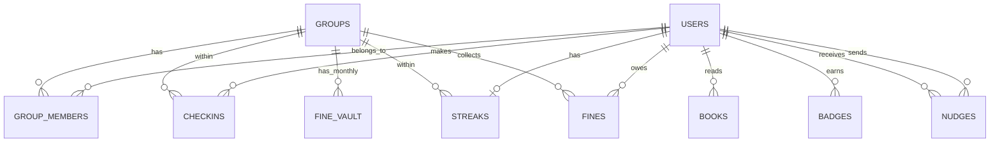

# خطة تنفيذ كاملة — تطبيق متابعة عادة القراءة (اسم مقترح: **ورد** / Wird)

> اسم "ورد" مجرد اقتراح (يعني "الوِرد اليومي") — سيبه أو غيّره براحتك، كل الكود والـ schema هنا محايدة الاسم.

---

## جدول المحتويات

1. [الفلسفة والمبادئ](#1-الفلسفة-والمبادئ)
2. [Tech Stack](#2-tech-stack)
3. [هيكل المشروع](#3-هيكل-المشروع-project-structure)
4. [تصميم قاعدة البيانات](#4-تصميم-قاعدة-البيانات-database-design)
5. [Backend — Auth](#5-backend--authentication)
6. [Backend — API Endpoints](#6-backend--api-endpoints)
7. [Backend — منطق الأعمال الأساسي](#7-backend--منطق-الأعمال-الأساسي-business-logic)
8. [Background Jobs](#8-background-jobs)
9. [Frontend — الصفحات والمكونات](#9-frontend--الصفحات-والمكونات)
10. [Frontend — إدارة الحالة](#10-frontend--إدارة-الحالة-state-management)
11. [تفاصيل الميزات](#11-تفاصيل-الميزات-feature-details)
12. [خطة التنفيذ المرحلية](#12-خطة-التنفيذ-المرحلية-roadmap)
13. [النشر (Deployment)](#13-النشر-deployment)
14. [التوسع المستقبلي](#14-التوسع-المستقبلي)

---

## 1. الفلسفة والمبادئ

- **القاعدة الذهبية:** التطبيق يكافئ **الالتزام**، مش **كمية القراءة**. اللي بيقرأ صفحة كل يوم لمدة 30 يوم لازم يتفوق على اللي قرأ 500 صفحة في يومين واختفى.
- **نظام شرف + شوية مرح:** غرامة رمزية (20 جنيه/يوم غياب) + Streaks + Confetti + ألقاب أسبوعية، من غير ما الجو يبقى ضغط أو منافسة عدائية.
- **مجموعة مغلقة:** أصحاب بس، دخول بكود دعوة (Invite Code)، مفيش "استكشاف مجموعات عامة" في الـ MVP.
- **مرن للمستقبل:** الـ Data Model من الأول مبني بحيث "القراءة" هي مجرد "نوع نشاط" (Activity Type) واحد، عشان تقدر تضيف حفظ قرآن / رياضة / لغة بعدين من غير ما تعيد بناء الأساس.

---

## 2. Tech Stack

نفس الـ stack اللي شغال بيه في DENTIX — أسرع طريق ليك لأنك متمكن فيه أصلاً، ومفيش داعي لتعلم أدوات جديدة لمشروع بالحجم ده.

| الطبقة | الأداة |
|---|---|
| Backend Framework | FastAPI (Python) |
| Database | PostgreSQL |
| ORM | SQLAlchemy 2.0 (async) + Alembic للـ migrations |
| Auth | JWT (access + refresh tokens) |
| Background Jobs | **APScheduler** جوه نفس عملية FastAPI (مش Celery — الحجم صغير <20 مستخدم، ومفيش داعي لتعقيد Redis/Broker إضافي) |
| Frontend | React 18 + Vite + TypeScript |
| Styling | Tailwind CSS |
| Server State | TanStack Query |
| Client/UI State | Zustand |
| Notifications (Phase 5) | WhatsApp Business Cloud API (Meta) |
| Hosting | VPS واحد بسيط (Docker Compose) — الحجم لا يحتاج أكتر من كده |

---

## 3. هيكل المشروع (Project Structure)

### Backend

```
wird-backend/
├── alembic/
│   └── versions/
├── app/
│   ├── main.py
│   ├── core/
│   │   ├── config.py          # قراءة الـ .env
│   │   ├── security.py        # hashing, JWT
│   │   └── scheduler.py       # APScheduler setup
│   ├── db/
│   │   ├── session.py
│   │   └── base.py
│   ├── models/
│   │   ├── user.py
│   │   ├── group.py
│   │   ├── checkin.py
│   │   ├── streak.py
│   │   ├── fine.py
│   │   ├── book.py
│   │   ├── badge.py
│   │   └── notification.py
│   ├── schemas/                # Pydantic schemas (مطابقة للـ models)
│   ├── api/
│   │   └── v1/
│   │       ├── routes/
│   │       │   ├── auth.py
│   │       │   ├── groups.py
│   │       │   ├── checkins.py
│   │       │   ├── leaderboard.py
│   │       │   ├── fines.py
│   │       │   ├── books.py
│   │       │   └── stats.py
│   │       └── deps.py         # dependencies (get_current_user, get_db)
│   ├── services/
│   │   ├── streak_service.py
│   │   ├── fine_service.py
│   │   ├── badge_service.py
│   │   └── whatsapp_service.py
│   └── tasks/
│       ├── daily_close.py      # قفل اليوم + حساب الغياب والغرامات
│       ├── weekly_titles.py
│       └── monthly_summary.py
├── tests/
├── .env.example
├── docker-compose.yml
└── requirements.txt
```

### Frontend

```
wird-frontend/
├── src/
│   ├── main.tsx
│   ├── App.tsx
│   ├── api/
│   │   ├── client.ts            # axios/fetch instance + interceptors
│   │   ├── auth.ts
│   │   ├── groups.ts
│   │   ├── checkins.ts
│   │   └── ...
│   ├── hooks/                   # TanStack Query hooks
│   │   ├── useCheckin.ts
│   │   ├── useLeaderboard.ts
│   │   └── useStreak.ts
│   ├── store/                   # Zustand
│   │   ├── authStore.ts
│   │   └── uiStore.ts
│   ├── pages/
│   │   ├── Login.tsx
│   │   ├── Register.tsx
│   │   ├── Onboarding.tsx       # إنشاء/انضمام لمجموعة
│   │   ├── Dashboard.tsx
│   │   ├── Calendar.tsx
│   │   ├── Leaderboard.tsx
│   │   ├── Bookshelf.tsx
│   │   ├── Vault.tsx            # خزنة الغرامات
│   │   ├── Profile.tsx
│   │   └── GroupSettings.tsx
│   ├── components/
│   │   ├── CheckinButton.tsx
│   │   ├── StreakFlame.tsx
│   │   ├── ProgressBar.tsx
│   │   ├── CalendarGrid.tsx
│   │   ├── LeaderboardRow.tsx
│   │   ├── BadgeDisplay.tsx
│   │   ├── ConfettiOverlay.tsx
│   │   ├── BookCard.tsx
│   │   ├── NudgeButton.tsx      # وسام "المنقذ"
│   │   └── AvatarFrame.tsx
│   └── styles/
├── .env.example
└── vite.config.ts
```

---

## 4. تصميم قاعدة البيانات (Database Design)

### ERD مبسّط



### الجداول بالتفصيل

#### `users`
| العمود | النوع | ملاحظات |
|---|---|---|
| id | UUID (PK) | |
| name | VARCHAR(100) | |
| email | VARCHAR(255) | UNIQUE, NOT NULL |
| phone | VARCHAR(20) | nullable — للواتساب لاحقًا |
| password_hash | VARCHAR(255) | bcrypt/argon2 |
| avatar_url | TEXT | nullable |
| level | INT | default 1 |
| xp_points | INT | default 0 |
| current_frame | VARCHAR(50) | default 'none' — إطار الصورة المفتوح |
| created_at | TIMESTAMPTZ | |

#### `groups`
| العمود | النوع | ملاحظات |
|---|---|---|
| id | UUID (PK) | |
| name | VARCHAR(100) | |
| invite_code | VARCHAR(10) | UNIQUE — كود عشوائي |
| owner_id | UUID (FK → users) | |
| checkin_deadline_time | TIME | default '00:00' |
| grace_period_hours | INT | default 3 (فترة سماح للتسجيل بعد نص الليل) |
| fine_amount | NUMERIC(10,2) | default 20.00 |
| currency | VARCHAR(10) | default 'EGP' |
| fun_mode_enabled | BOOLEAN | default true (Confetti/ألقاب) |
| monthly_page_goal | INT | nullable — هدف المجموعة الجماعي |
| created_at | TIMESTAMPTZ | |

#### `group_members`
| العمود | النوع | ملاحظات |
|---|---|---|
| id | UUID (PK) | |
| group_id | UUID (FK) | |
| user_id | UUID (FK) | |
| role | ENUM('owner','member') | |
| status | ENUM('active','left') | |
| joined_at | TIMESTAMPTZ | |
| — | UNIQUE(group_id, user_id) | |

#### `checkins`
| العمود | النوع | ملاحظات |
|---|---|---|
| id | UUID (PK) | |
| user_id | UUID (FK) | |
| group_id | UUID (FK) | |
| checkin_date | DATE | اليوم اللي بيتسجل عنه (مش وقت الضغط) |
| pages_read | INT | nullable |
| note | VARCHAR(280) | nullable — "بتقرا إيه دلوقتي" |
| checked_in_at | TIMESTAMPTZ | |
| is_late | BOOLEAN | سجّل في فترة السماح ولا لأ |
| — | UNIQUE(user_id, group_id, checkin_date) | يمنع تكرار تسجيل نفس اليوم |

#### `streaks`
| العمود | النوع | ملاحظات |
|---|---|---|
| id | UUID (PK) | |
| user_id | UUID (FK) | |
| group_id | UUID (FK) | |
| current_streak | INT | default 0 |
| longest_streak | INT | default 0 |
| last_checkin_date | DATE | nullable |
| freezes_remaining | INT | default 2 (شهريًا) |
| freezes_used_total | INT | default 0 |
| — | UNIQUE(user_id, group_id) | |

#### `fines`
| العمود | النوع | ملاحظات |
|---|---|---|
| id | UUID (PK) | |
| user_id | UUID (FK) | |
| group_id | UUID (FK) | |
| fine_date | DATE | يوم الغياب |
| amount | NUMERIC(10,2) | |
| status | ENUM('pending','paid') | |
| paid_at | TIMESTAMPTZ | nullable |

#### `fine_vault` (خزنة الشهر)
| العمود | النوع | ملاحظات |
|---|---|---|
| id | UUID (PK) | |
| group_id | UUID (FK) | |
| month | DATE | أول يوم في الشهر (كمفتاح) |
| total_amount | NUMERIC(10,2) | |
| status | ENUM('open','settled') | |
| settlement_note | TEXT | nullable — "اتصرفت في عزومة" مثلاً |
| settled_at | TIMESTAMPTZ | nullable |

#### `books`
| العمود | النوع | ملاحظات |
|---|---|---|
| id | UUID (PK) | |
| user_id | UUID (FK) | |
| group_id | UUID (FK) | |
| title | VARCHAR(255) | |
| author | VARCHAR(255) | nullable |
| cover_url | TEXT | nullable |
| total_pages | INT | nullable |
| status | ENUM('reading','finished') | |
| started_at | DATE | nullable |
| finished_at | DATE | nullable |

#### `badges`
| العمود | النوع | ملاحظات |
|---|---|---|
| id | UUID (PK) | |
| user_id | UUID (FK) | |
| group_id | UUID (FK) | |
| badge_type | VARCHAR(50) | 'streak_7','streak_30','streak_100','first_book','weekly_champion'... |
| earned_at | TIMESTAMPTZ | |

#### `weekly_titles`
| العمود | النوع | ملاحظات |
|---|---|---|
| id | UUID (PK) | |
| group_id | UUID (FK) | |
| week_start | DATE | |
| title_type | VARCHAR(50) | 'legend_of_commitment','reader_of_week','fastest_comeback','most_consistent' |
| user_id | UUID (FK) | |

#### `nudges` (وسام المنقذ)
| العمود | النوع | ملاحظات |
|---|---|---|
| id | UUID (PK) | |
| group_id | UUID (FK) | |
| from_user_id | UUID (FK) | |
| to_user_id | UUID (FK) | |
| nudge_date | DATE | |
| resulted_in_checkin | BOOLEAN | default false — بيتحدّث لو حصل check-in بعدها |
| — | UNIQUE(from_user_id, to_user_id, nudge_date) | سقف: نكزة واحدة لكل شخص/يوم |

#### `monthly_summaries` (كاش لملخص Wrapped)
| العمود | النوع | ملاحظات |
|---|---|---|
| id | UUID (PK) | |
| user_id | UUID (FK) | |
| group_id | UUID (FK) | |
| month | DATE | |
| stats_json | JSONB | نسبة الالتزام، صفحات، كتب، أطول streak |
| generated_at | TIMESTAMPTZ | |

**Indexes مهمة (لتفادي N+1 وبطء الاستعلامات):**
`checkins(user_id, group_id, checkin_date)`, `checkins(group_id, checkin_date)` للتقويم الجماعي، `fines(group_id, status)`، `streaks(group_id, current_streak DESC)` للـ leaderboard.

---

## 5. Backend — Authentication

- **تسجيل الدخول:** Email + Password (بدون OTP في الـ MVP — مجموعة صغيرة موثوقة).
- **Hashing:** `bcrypt` أو `argon2` (زي DENTIX).
- **Tokens:** Access Token (15-30 دقيقة) + Refresh Token (7-30 يوم)، نفس نمط DENTIX.
- **الانضمام لمجموعة:** مفيش "تسجيل عام" — إما:
  1. تنشئ مجموعة جديدة (تبقى Owner) → يتولّد `invite_code` عشوائي (6-8 حروف/أرقام).
  2. تدخل كود دعوة موجود → تنضم كـ Member.
- **الصلاحيات:** Owner بس يقدر يعدّل إعدادات المجموعة (مبلغ الغرامة، وقت القفل، تفعيل Fun Mode).

---

## 6. Backend — API Endpoints

| Method | Path | الوصف | Auth |
|---|---|---|---|
| POST | `/auth/register` | تسجيل مستخدم جديد | ❌ |
| POST | `/auth/login` | دخول | ❌ |
| POST | `/auth/refresh` | تجديد التوكن | Refresh Token |
| POST | `/groups` | إنشاء مجموعة جديدة | ✅ |
| POST | `/groups/join` | انضمام بكود دعوة | ✅ |
| GET | `/groups/{id}` | تفاصيل المجموعة | ✅ عضو |
| PATCH | `/groups/{id}/settings` | تعديل إعدادات (غرامة، وقت قفل...) | ✅ Owner |
| POST | `/checkins` | تسجيل حضور اليوم (pages, note اختياري) | ✅ عضو |
| GET | `/checkins/today` | حالة اليوم للمستخدم | ✅ عضو |
| GET | `/groups/{id}/calendar?month=` | بيانات التقويم الجماعي (شبكة 🟩🟥) | ✅ عضو |
| GET | `/groups/{id}/leaderboard` | ترتيب نسبة الالتزام | ✅ عضو |
| GET | `/groups/{id}/stats` | تقدّم الهدف الجماعي (صفحات الشهر) | ✅ عضو |
| POST | `/nudges` | إرسال "نكزة" لعضو لسه ما سجّلش | ✅ عضو |
| GET | `/groups/{id}/vault` | خزنة الغرامات الحالية | ✅ عضو |
| POST | `/groups/{id}/vault/settle` | تصفية الخزنة آخر الشهر | ✅ Owner |
| PATCH | `/fines/{id}/mark-paid` | تعليم غرامة كمدفوعة | ✅ Owner |
| POST | `/books` | إضافة كتاب للرف | ✅ عضو |
| PATCH | `/books/{id}` | تحديث حالة كتاب (خلّصت) | ✅ عضو |
| GET | `/groups/{id}/bookshelf` | رف الكتب الجماعي | ✅ عضو |
| GET | `/users/me/summary?month=` | ملخص Wrapped الشهري | ✅ عضو |
| GET | `/groups/{id}/hall-of-fame` | أكثر الناس التزامًا/streak/كتب | ✅ عضو |

---

## 7. Backend — منطق الأعمال الأساسي (Business Logic)

### 7.1 حساب الـ Streak (بيشتغل في الـ Daily Close Job)

```
لكل عضو نشط في المجموعة:
    لو عمل check-in لـ "أمس" (قبل الـ deadline أو في فترة السماح):
        current_streak += 1
        longest_streak = max(longest_streak, current_streak)
    وإلا لو عنده freezes_remaining > 0 ويختار (أو تلقائي) استخدام Freeze:
        current_streak يفضل زي ما هو (بدون زيادة ولا كسر)
        freezes_remaining -= 1
    وإلا:
        current_streak = 0
        إنشاء سجل fine (amount = group.fine_amount)
        إنشاء سجل غياب لليوم في التقويم
```

### 7.2 نسبة الالتزام (المعيار الأساسي للـ Leaderboard)

```
commitment_rate = (عدد أيام الحضور منذ الانضمام) ÷ (عدد الأيام منذ الانضمام) × 100
```
الـ Leaderboard بيترتب بالنسبة دي **مش** بعدد الصفحات — الصفحات تتعرض كرقم ثانوي جنبها بس.

### 7.3 حساب الغرامة والقفل اليومي

- `checkin_deadline_time` (افتراضي 00:00) + `grace_period_hours` (افتراضي 3 ساعات) = آخر وقت مسموح فيه تسجيل "أمس".
- بعد انتهاء فترة السماح، الـ Daily Close Job بيقفل اليوم فعليًا ويطبّق المنطق في 7.1.

### 7.4 الألقاب الأسبوعية

Job أسبوعي (كل سبت مثلاً) بيحسب:
- 🔥 أسطورة الالتزام → أعلى `commitment_rate` في الأسبوع
- 📚 قارئ الأسبوع → أعلى مجموع صفحات
- ⚡ أسرع عودة → أكبر فرق بين streak قديم اتكسر وbدأ من جديد بسرعة
- 💎 أكثر عضو ثابت → صفر أيام غياب في الأسبوع

### 7.5 الشارات (Badges) — تتفعّل عند:
`streak = 7` (Confetti 🎉) → `streak = 30` → `streak = 100` (إطار ذهبي) → أول كتاب يتم إنهاؤه → أول من سجّل اليوم ("أول قارئ اليوم") → آخر واحد سجّل ("آخر لحظة" 😄).

---

## 8. Background Jobs

باستخدام **APScheduler** جوه عملية FastAPI نفسها (مفيش داعي لـ Celery/Redis بحجم المجموعة ده):

| Job | التوقيت | المهمة |
|---|---|---|
| `daily_close` | كل يوم عند (deadline + grace_period) | تطبيق منطق 7.1 و7.3 لكل مجموعة (كل مجموعة ليها وقتها الخاص) |
| `weekly_titles` | كل سبت الساعة 00:05 | حساب الألقاب الأسبوعية (7.4) |
| `monthly_summary` | أول يوم في الشهر | توليد `monthly_summaries` + تصفير `freezes_remaining` + فتح `fine_vault` جديدة |
| `whatsapp_reminder` (Phase 5) | كل يوم قبل الـ deadline بساعة | تذكير لمن لسه ما سجّلش |

---

## 9. Frontend — الصفحات والمكونات

| الصفحة | المحتوى الأساسي |
|---|---|
| **Login / Register** | فورم بسيط |
| **Onboarding** | اختيار: إنشاء مجموعة / الانضمام بكود |
| **Dashboard (الرئيسية)** | زرار Check-in كبير، شعلة الـ Streak 🔥، شريط تقدّم الهدف الجماعي، حالة أعضاء المجموعة النهارده |
| **Calendar** | شبكة 🟩/🟥 شخصية + جماعية (شهر بشهر) |
| **Leaderboard** | ترتيب بنسبة الالتزام + صفحات كرقم ثانوي |
| **Bookshelf** | رف شخصي + رف جماعي (اكتشاف كتب بعض) |
| **Vault** | خزنة الغرامات، حالة كل غرامة (اتدفعت/لسه)، اقتراح تصرف الخزنة |
| **Profile** | المستوى، الشارات، الإطار المفتوح، أطول Streak |
| **Group Settings** (Owner فقط) | تعديل مبلغ الغرامة، وقت القفل، فترة السماح، تفعيل Fun Mode |

### مكونات مشتركة رئيسية
`CheckinButton`, `StreakFlame`, `ProgressBar`, `CalendarGrid`, `LeaderboardRow`, `BadgeDisplay`, `ConfettiOverlay`, `BookCard`, `NudgeButton`, `AvatarFrame`.

> ملاحظة تصميم: تصميم بسيط وجذاب (مش مزدحم) — الأولوية للوضوح: حالة اليوم + الـ Streak لازم تكونوا أول حاجة تبان من غير scroll.

---

## 10. Frontend — إدارة الحالة (State Management)

- **Zustand:** بيانات الجلسة (auth token, user info)، المجموعة الحالية المختارة، حالة الـ UI (مودالات، Confetti trigger).
- **TanStack Query:** كل بيانات السيرفر (checkins, leaderboard, calendar, vault, bookshelf) — مع `staleTime` مناسب للبيانات اللي بتتغير قليل زي leaderboard (دقيقة-دقيقتين) وinvalidate فوري بعد أي check-in.

---

## 11. تفاصيل الميزات (Feature Details)

- **Streak Freeze:** كل عضو 1-2 فريز شهريًا يستخدمهم لظروف السفر/المرض من غير كسر الـ Streak ولا غرامة — بيتصفّروا أول كل شهر.
- **فترة السماح بعد نص الليل:** تسجيل "أمس" مسموح لحد الساعة 3 فجرًا مثلاً (قابل للتعديل من إعدادات المجموعة).
- **رف الكتب:** كل كتاب يتم إنهاؤه يضاف للرف الشخصي والجماعي — يغذّي شارة "أكثر شخص أنهى كتب".
- **ملخص شهري (Wrapped):** كارت صورة (SVG/Canvas) يتولّد آخر الشهر: نسبة الالتزام، صفحات، كتب، أطول Streak — جاهز للمشاركة على الواتساب.
- **وسام المنقذ:** نكزة لعضو لسه ما سجّلش، سقف نكزة واحدة/شخص/يوم لمنع الاستغلال، ونقطة تشجيع لو النكزة نتج عنها check-in فعلي.
- **احتفال آخر اليوم:** لو كل الأعضاء النشطين سجّلوا حضور، رسالة/Confetti جماعية "يوم كامل بدون غياب".
- **تكامل واتساب (Phase 5):** عبر WhatsApp Business Cloud API الرسمية من Meta (تفادي المكتبات غير الرسمية لتفادي الحظر) — تذكير قبل الموعد، إعلان حضور، الملخص الشهري.

---

## 12. خطة التنفيذ المرحلية (Roadmap)

| المرحلة | المدة التقريبية | المحتوى |
|---|---|---|
| **Phase 0 — الإعداد** | 3-4 أيام | Repo، Docker Compose، قاعدة البيانات، هيكل Auth الأساسي |
| **Phase 1 — MVP الأساسي** | أسبوع-أسبوعين | تسجيل دخول، إنشاء/انضمام مجموعة، Check-in يومي، حساب Streak، Leaderboard بسيط |
| **Phase 2 — الغرامات والتقويم** | أسبوع | جدول Fines، خزنة الشهر (Vault)، صفحة Calendar |
| **Phase 3 — التحفيز** | أسبوع | الشارات، Confetti، الألقاب الأسبوعية، إطارات الصورة |
| **Phase 4 — المحتوى الاجتماعي** | أسبوع | رف الكتب، وسام المنقذ، الملخص الشهري (Wrapped) |
| **Phase 5 — واتساب والتلميع** | أسبوع-أسبوعين | تكامل WhatsApp، إشعارات، مراجعة UI نهائية، Deploy |

---

## 13. النشر (Deployment)

بما إن الحجم صغير (<20 مستخدم)، VPS واحد بسيط كافي جدًا:

```
docker-compose.yml
├── backend    (FastAPI + Uvicorn)
├── frontend   (Nginx يخدم build الـ Vite الثابت)
└── postgres
```

- الأسرار (DB password, JWT secret, WhatsApp API token) في `.env` **غير مرفوع على الـ Git** — نفس نمط الـ hardening اللي اتعمل في DENTIX (تجنّب تكرار غلطة الأسرار المكشوفة).
- Backups دورية لقاعدة البيانات (حتى لو `pg_dump` مجدول بسيط، مفيش داعي لحل معقّد بالحجم ده).
- Migrations عبر Alembic فقط (مفيش نظامين هجرة متوازيين).

---

## 14. التوسع المستقبلي

الـ Data Model مصمم من الأول بحيث `checkins` مرتبطة بـ `group` عمومًا، مش بـ "قراءة" تحديدًا. لو حبيت بعدين تفتح المنصة لعادات تانية (حفظ قرآن، رياضة، لغة، كتابة يومية)، أبسط طريق هو:

- إضافة عمود `activity_type` في `groups` (بدل ما تبقى المجموعة "قراءة" بس).
- نفس جداول `checkins` / `streaks` / `fines` / `badges` تشتغل من غير تعديل جوهري.
- الفرق الوحيد الحقيقي هيكون في الواجهة (مثلاً "صفحات" تتحول لـ "دقائق تمرين" حسب نوع النشاط).

---

**الخطوة التالية المقترحة:** لو عايز، أقدر أبدأ أكتب فعليًا الـ SQLAlchemy models + أول Alembic migration، أو أبدأ بـ FastAPI skeleton (auth + groups) كنقطة انطلاق.
